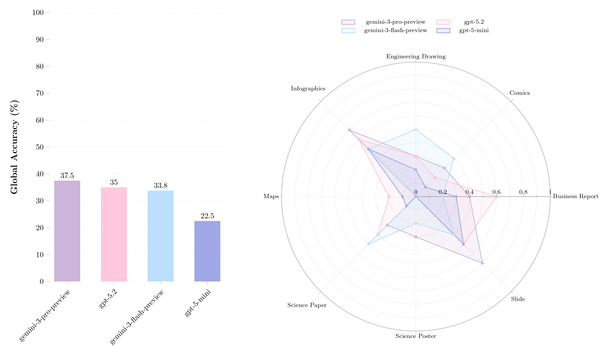

<p align="center">
  
</p>

<h1 align="center">DocVQA 2026 | ICDAR2026 Competition on Multimodal Reasoning over Documents in Multiple Domains</h1>

 <p align="center">
  <a href="https://www.docvqa.org/challenges/2026">
    
  </a>
  <a href="https://huggingface.co/datasets/VLR-CVC/DocVQA-2026">
    
  </a>
  <a href="https://github.com/VLR-CVC/DocVQA2026">
    
  </a>
</p>

Building upon previous DocVQA benchmarks, this evaluation dataset introduces challenging reasoning questions over a diverse collection of documents spanning eight domains, including business reports, scientific papers, slides, posters, maps, comics, infographics, and engineering drawings.

By expanding coverage to new document domains and introducing richer question types, this benchmark seeks to push the boundaries of multimodal reasoning and promote the development of more general, robust document understanding models.

## 🏆 Competition Hosting & Test Set

The official DocVQA 2026 competition is hosted on the **Robust Reading Competition (RRC)** platform, which provides the standardized framework for our leaderboards, submissions, and result tracking. 

> [!NOTE]
> **Test Set Status:** *Coming Soon!*  By the time being, please use the provided validation set and the evaluation code.

<p align="center">
  <a href="https://www.docvqa.org/challenges/2026" style="background-color: #007bff; color: white; padding: 12px 24px; text-decoration: none; border-radius: 6px; font-weight: bold; font-size: 18px; display: inline-block;">
    Join the Challenge on the RRC Platform
  </a>
</p>


## Load & Inspect the Data

```python
from datasets import load_dataset

# 1. Load the dataset
dataset = load_dataset("VLR-CVC/DocVQA-2026", split="val")

# 2. Access a single sample (one document)
sample = dataset[0]

doc_id = sample["doc_id"]
category = sample["doc_category"]
print(f"Document ID: {doc_id} ({category})")

# 3. Access Images
# 'document' is a list of PIL Images (one for each page)
images = sample["document"]
print(f"Number of pages: {len(images)}")
images[0].show()  

# 4. Access Questions and Answers
questions = sample["questions"]
answers = sample["answers"]

# 5. Visualize Q&A pairs for a document
for q, q_id, a in zip(questions['question'], questions['question_id'], answers['answer']):
    print("-" * 50)
    print(f"Question ID: {q_id}")
    print(f"Question: {q}")
    print(f"Answer: {a}")
    print("-" * 50)
```

## Structure of a Sample

<details>
<summary><b>Click to expand the JSON structure</b></summary>
  
```json
{
  "doc_id": "maps_2",
  "doc_category": "maps",
  "preview": "<image>",
  "document": [
    "<image>"
  ],
  "questions": {
    "question_id": [
      "maps_2_q1",
      "maps_2_q2",
      "maps_2_q3",
      "maps_2_q4",
      "maps_2_q5"
    ],
    "question": [
      "By which kind of road are Colchester and Yantic connected?",
      "Which is the most populated town in the E-10 coordinates?",
      "What is the milage between Taunton and Dedham? Do not provide the unit.",
      "From Worcester I take highway 140 towards Taunton, I take the second macadam & gravel road that I encounter, continuing on that road, what town do I reach?",
      "If I follow highway 109 from Pittsfield to Northampton, how many towns do I cross (without counting start and ending location)?"
    ]
  },
  "answers": {
    "question_id": [
      "maps_2_q1",
      "maps_2_q2",
      "maps_2_q3",
      "maps_2_q4",
      "maps_2_q5"
    ],
    "answer": [
      "Macadam & Gravel",
      "Wareham",
      "27",
      "Woonsocket",
      "7"
    ]
  }
}
```
</details>


## Results

<p align="center">
  
  <br>
  <em>Figure 1: Performance comparison across domains.</em>
</p>


<div align="center">
  <table>
    <thead>
      <tr>
        <th align="left">Category</th>
        <th align="center">Gemini 3 Pro Preview</th>
        <th align="center">GPT-5.2</th>
        <th align="center">Gemini 3 Flash Preview</th>
        <th align="center">GPT-5 Mini</th>
      </tr>
    </thead>
    <tbody>
      <tr>
        <td align="left"><b>Overall Accuracy</b></td>
        <td align="center"><b>0.375</b></td>
        <td align="center">0.350</td>
        <td align="center">0.3375</td>
        <td align="center">0.225</td>
      </tr>
      <tr>
        <td align="left">Business Report</td>
        <td align="center">0.400</td>
        <td align="center"><b>0.600</b></td>
        <td align="center">0.200</td>
        <td align="center">0.300</td>
      </tr>
      <tr>
        <td align="left">Comics</td>
        <td align="center">0.300</td>
        <td align="center">0.200</td>
        <td align="center"><b>0.400</b></td>
        <td align="center">0.100</td>
      </tr>
      <tr>
        <td align="left">Engineering Drawing</td>
        <td align="center">0.300</td>
        <td align="center">0.300</td>
        <td align="center"><b>0.500</b></td>
        <td align="center">0.200</td>
      </tr>
      <tr>
        <td align="left">Infographics</td>
        <td align="center"><b>0.700</b></td>
        <td align="center">0.600</td>
        <td align="center">0.500</td>
        <td align="center">0.500</td>
      </tr>
      <tr>
        <td align="left">Maps</td>
        <td align="center">0.000</td>
        <td align="center"><b>0.200</b></td>
        <td align="center">0.000</td>
        <td align="center">0.100</td>
      </tr>
      <tr>
        <td align="left">Science Paper</td>
        <td align="center">0.300</td>
        <td align="center">0.400</td>
        <td align="center"><b>0.500</b></td>
        <td align="center">0.100</td>
      </tr>
      <tr>
        <td align="left">Science Poster</td>
        <td align="center"><b>0.300</b></td>
        <td align="center">0.000</td>
        <td align="center">0.200</td>
        <td align="center">0.000</td>
      </tr>
      <tr>
        <td align="left">Slide</td>
        <td align="center"><b>0.700</b></td>
        <td align="center">0.500</td>
        <td align="center">0.400</td>
        <td align="center">0.500</td>
      </tr>
    </tbody>
  </table>
</div>

> [!NOTE]
> **Evaluation Parameters:**
> * **GPT Models:** "High thinking" enabled, temperature set to `1.0`.
> * **Gemini Models:** "High thinking" enabled, temperature set to `0.0`.

> [!WARNING]
> **API Constraints:** > Both models were evaluated via their respective APIs. If a sample fails because the input files are too large, the result counts as a failure. For example, the file input limit for OpenAI models is 50MB, and several comics in this dataset surpass that threshold.


--------

<div style="border: 1px solid black; background-color: white; color: black; padding: 20px; border-radius: 8px;">
  <h2 style="margin-top: 0; color: black;">📝 Submission Guidelines & Formatting Rules</h2>
  <p>To ensure fair and accurate evaluation across all participants, submissions are evaluated using automated metrics. Therefore, all model outputs must strictly adhere to the following formatting rules:</p>
  <ul>
    <li><strong style="color: black;">Source Adherence:</strong> Only provide answers found directly within the document. If the question is unanswerable given the provided image, the response must be exactly: <code>"Unknown"</code>.</li>
    <li><strong style="color: black;">Multiple Answers:</strong> List multiple answers in their order of appearance, separated by a comma and a single space. <strong style="color: black;">Do not</strong> use the word "and". <em>(Example: <code>Answer A, Answer B</code>)</em></li>
    <li><strong style="color: black;">Numbers & Units:</strong> Convert units to their standardized abbreviations (e.g., use <code>kg</code> instead of "kilograms", <code>m</code> instead of "meters"). Always place a single space between the number and the unit. <em>(Example: <code>50 kg</code>, <code>10 USD</code>)</em></li>
    <li><strong style="color: black;">Percentages:</strong> Attach the <code>%</code> symbol directly to the number with no space. <em>(Example: <code>50%</code>)</em></li>
    <li><strong style="color: black;">Dates:</strong> Convert all dates to the standardized <code>YYYY-MM-DD</code> format. <em>(Example: "Jan 1st 24" becomes <code>2024-01-01</code>)</em></li>
    <li><strong style="color: black;">Decimals:</strong> Use a single period (<code>.</code>) as a decimal separator, never a comma. <em>(Example: <code>3.14</code>)</em></li>
    <li><strong style="color: black;">Thousands Separator:</strong> Do not use commas to separate large numbers. <em>(Example: <code>1000</code>, not <code>1,000</code>)</em></li>
    <li><strong style="color: black;">No Filler Text:</strong> Output <strong style="color: black;">only</strong> the requested data. Do not frame your answer in full sentences (e.g., avoid "The answer is...").</li>
  </ul>
  <p><strong style="color: black;">Final Output Format:</strong> When generating the final extracted data, your system must prefix the response with the following exact phrasing:</p>
  <pre style="background-color: white; color: black; border: 1px dashed black; padding: 10px; border-radius: 4px;"><code>FINAL ANSWER: [Your formatted answer]</code></pre>
</div>

---------

## Evaluation Code & Baselines

To ensure consistency and fairness, all submissions are evaluated using our official automated evaluation pipeline. This pipeline handles the extraction of your model's answers and applies both strict formatting checks (for numbers, dates, and units) and relaxed text matching (ANLS) for text-based answers.

You can find the complete, ready-to-use evaluation script in our official GitHub repository:
👉 **[VLR-CVC/DocVQA2026 GitHub Repository](https://github.com/VLR-CVC/DocVQA2026)**

### What you will find in the repository:

* **The Evaluator Script:** The core logic used to parse your model's outputs and calculate the final scores. You can use this script to test and evaluate your predictions locally before making an official submission.
* **The Baseline Master Prompt:** We have included the exact prompt structure (`get_evaluation_prompt()`) used for our baseline experiments. This prompt is heavily engineered to enforce the competition's mandatory reasoning protocols and strict output formatting. 

We highly recommend reviewing both the evaluation script and the Master Prompt. You are welcome to use the provided prompt out-of-the-box or adapt it to better guide your own custom models!

## Dataset Structure

The dataset consists of:
1.  **Images:** High-resolution PNG renders of document pages located in the `images/` directory.
2.  **Annotations:** A Parquet file (`val.parquet`) containing the questions, answers, and references to the image paths.
